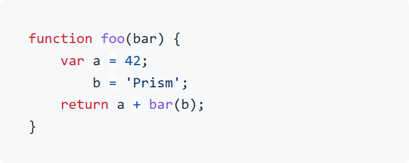
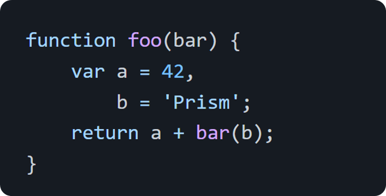

<a name="readme-top"></a>
<div align="center">

<!-- <a href="#">
  
</a><br> -->

<h1>
  Prism GitHub themes
</h1>

<p>
  Real GitHub themes for Prism.js.
</p>

[![Pull Requests][github-pr-badge]][github-pr-link]
[![Issues][github-issue-badge]][github-issue-link]
[![License][github-license-badge]](LICENSE)

</div>


<!-- Main Body -->

## Introduction
Real GitHub themes for [Prism.js](https://prismjs.com).

Based on [GitHub](https://github.com).


## Themes
### GitHub Light
[](/themes/prism-theme-github-light.css)
```html
<link rel="stylesheet" href="https://cdn.jsdelivr.net/gh/katorlys/prism-theme-github/themes/prism-theme-github-light.css">
```

### GitHub Dark
[](/themes/prism-theme-github-dark.css)
```html
<link rel="stylesheet" href="https://cdn.jsdelivr.net/gh/katorlys/prism-theme-github/themes/prism-theme-github-dark.css">
```

### GitHub Copilot
[](/themes/prism-theme-github-copilot.css)
```html
<link rel="stylesheet" href="https://cdn.jsdelivr.net/gh/katorlys/prism-theme-github/themes/prism-theme-github-copilot.css">
```  

## Usage
### CDN
Embed the CDN links provided above to use the themes in your project.

### npmjs
Or get the themes from npmjs:
```sh
npm install prism-theme-github
```


<!-- /Main Body -->


<div align="right">
  
[![BACK TO TOP][back-to-top-button]](#readme-top)

</div>

---

<div align="center">

<p>
  Copyright &copy; 2024-present <a target="_blank" href="https://github.com/katorlys">Katorly Lab</a>
</p>

[![License][github-license-badge-bottom]](LICENSE)

</div>

[back-to-top-button]: https://img.shields.io/badge/BACK_TO_TOP-151515?style=flat-square
[github-pr-badge]: https://img.shields.io/github/issues-pr/katorlys/prism-theme-github?label=pulls&labelColor=151515&color=79E096&style=flat-square
[github-pr-link]: https://github.com/katorlys/prism-theme-github/pulls
[github-issue-badge]: https://img.shields.io/github/issues/katorlys/prism-theme-github?labelColor=151515&color=FFC868&style=flat-square
[github-issue-link]: https://github.com/katorlys/prism-theme-github/issues
[github-license-badge]: https://img.shields.io/github/license/katorlys/prism-theme-github?labelColor=151515&color=EFEFEF&style=flat-square
<!-- https://img.shields.io/badge/license-CC_BY--NC--SA_4.0-EFEFEF?labelColor=151515&style=flat-square -->
[github-license-badge-bottom]: https://img.shields.io/github/license/katorlys/prism-theme-github?labelColor=151515&color=EFEFEF&style=for-the-badge
<!-- https://img.shields.io/badge/license-CC_BY--NC--SA_4.0-EFEFEF?labelColor=151515&style=for-the-badge -->